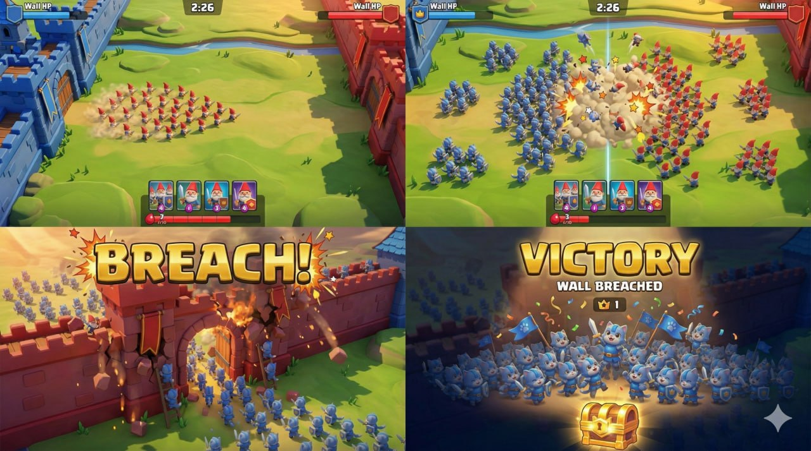

# Army Royale

Army Royale is a mobile landscape real-time battle prototype where two players command massive armies across an open battlefield and try to breach the opposing fortress wall.

## Prototype goals
- Moving front line tug-of-war gameplay
- Fortress wall breach as the main payoff moment
- Mobile-first landscape presentation
- Strong readability from a high battlefield camera
- Visual direction guided by the project mockup and GDD

## Visual target mockup

### What this mockup locks in
- Landscape battlefield with a blue fortress on the left and a red fortress on the right
- High, readable battlefield camera with strong overview of the whole fight
- Dense center-field army collisions as the core spectacle
- Minimal HUD with wall HP, timer, cards, and elixir visible without covering the battlefield
- Wall breach as the main payoff moment and emotional highlight
- Strong visual alignment target for battlefield framing, readability, and victory presentation

## Planned stack
- Three.js
- TypeScript
- Vite
- React HUD overlay
- Zustand

## Prototype scope
- 1v1 prototype
- Local play + AI opponent
- 1 battlefield
- 1 playable faction initially
- Aggregate simulation, not per-unit gameplay simulation

## Source of truth
The prototype direction is based on:
- `docs/GDD.md`
- `docs/ART-DIRECTION.md`
- `docs/TECH-PLAN.md`

## Status
Pre-production and first-playable setup.
